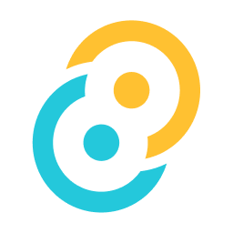
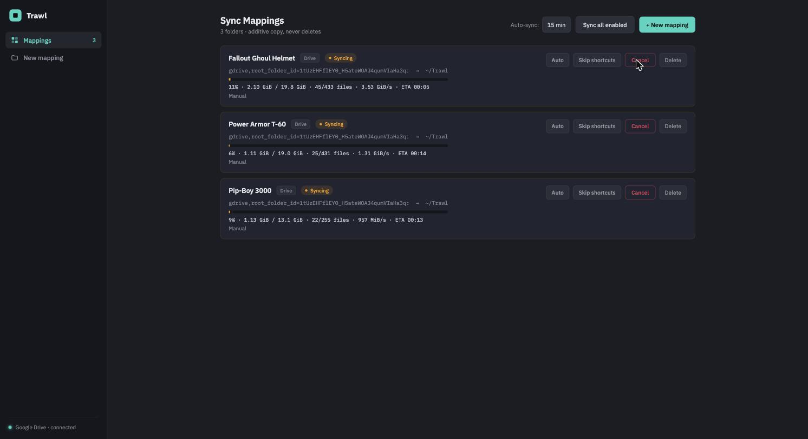
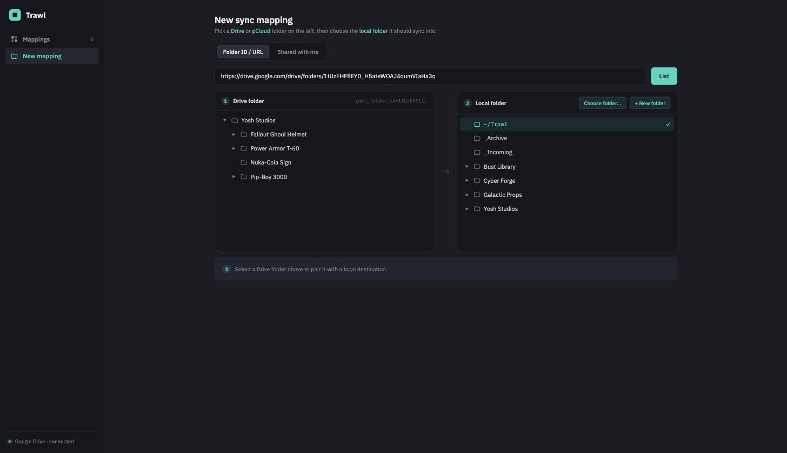

<div align="center">



# Trawl

### Pull shared cloud folders into a local library.

A small **desktop app** that syncs **Google Drive & pCloud folders by link** into a **local folder** using [`rclone`](https://rclone.org) under the hood. Paste a folder URL, pick a local destination, and pull — **additive copy only, it never deletes at the destination.**

[](https://github.com/kurenn/trawl/releases/latest)
[](https://github.com/kurenn/trawl/actions/workflows/release.yml)
[](LICENSE)


[](https://buymeacoffee.com/kurito)

[**⬇️ Download**](https://github.com/kurenn/trawl/releases/latest) &nbsp;·&nbsp; [**🧭 Quick start**](#-quick-start) &nbsp;·&nbsp; [**☕ Support**](https://buymeacoffee.com/kurito)

<br/>



</div>

---

## Why Trawl?

Someone shares a Google Drive or pCloud folder by link — models, assets, a photo dump — and you just want a **local copy that stays current**. `rsync` can't talk to Drive; the web UI won't bulk-download; and a full two-way sync risks clobbering your files. Trawl points at a shared folder, pairs it with a local destination, and pulls on demand or on a schedule. Transfers are **additive** — new and changed files are copied down, and **nothing at the destination is ever deleted.**

## ✨ Features

- 🔗 **Sync by link** — paste a Google Drive folder URL / ID (or pick from **Shared with me**), or a **pCloud** public link. Trawl extracts the folder and roots rclone at it.
- 📁 **One local library** — every mapping lands in a folder under your library root (default `~/Trawl`, auto-created); the right-hand pane browses it.
- 📊 **Live progress** — the Rust backend streams parsed `rclone` stats to the UI: percent, bytes, files, speed, and ETA, per run.
- 🔄 **Auto-sync scheduler** — opt any mapping into background syncs on an interval; `rclone copy` is incremental, so idle runs are cheap.
- 🧭 **Cancel · Retry · Delete** — full control over every mapping, with a persisted last-run status and a clear error banner when something fails.
- 🪢 **Folder-loop guard + Skip shortcuts** — detects a source that recurses forever (a Google Drive shortcut pointing back up its own tree) and stops the run early. Flip **Skip shortcuts** on a Drive mapping to ignore shortcuts entirely and copy right through the loop.
- 🛡️ **Copy, never delete** — transfers are additive; the destination is never pruned. Destinations are containment-checked so a mapping can never escape the library root.

> 🔒 **Local & private.** rclone's OAuth token stays on your machine (`~/.config/rclone/rclone.conf`); Trawl has no accounts, cloud, or telemetry.

## 📸 Screenshots

<table>
  <tr>
    <td width="50%"><br/><sub><b>New mapping</b> — pair a by-link Drive/pCloud source with a local destination.</sub></td>
    <td width="50%"><br/><sub><b>Live sync</b> — progress, cancel/retry, and per-mapping auto-sync.</sub></td>
  </tr>
</table>

## 🚀 Quick start

**1. Install rclone** (Trawl shells out to it):

```bash
brew install rclone      # macOS · see rclone.org/downloads for Windows/Linux
```

**2. Download Trawl** — grab the latest build for your OS from the [**Releases**](https://github.com/kurenn/trawl/releases/latest) page.

- **macOS** — open the `.dmg` and drag Trawl to **Applications**. It isn't notarized yet, so macOS may say *"Trawl is damaged."* It isn't — clear the download quarantine flag once:
  ```bash
  xattr -dr com.apple.quarantine /Applications/Trawl.app
  ```
  (Apple Silicon → `aarch64.dmg`, Intel → `x64.dmg`.)
- **Windows** — run the `.msi` or `-setup.exe`. On SmartScreen: **More info → Run anyway**.
- **Linux** — `.AppImage` (chmod +x and run), `.deb`, or `.rpm`.

**3. Connect** — on first launch, if you're syncing Google Drive and no remote is configured, Trawl shows a **Connect Google Drive** screen. *Connect* runs rclone's OAuth flow in your browser; the token is saved once. (pCloud public links need no connection.)

## 🛠️ Build from source

Requires **Node 20+**, the **Rust** toolchain ([Tauri v2 prerequisites](https://v2.tauri.app/start/prerequisites/)), and **rclone** on your `PATH`.

```bash
git clone https://github.com/kurenn/trawl.git
cd trawl
npm install

npm run dev          # web UI on a simulated backend (http://localhost:1420)
npm run tauri dev    # full desktop app against real rclone
npm run tauri build  # → src-tauri/target/release/bundle/ (.dmg, .msi, .AppImage…)
```

`npm run dev` runs the whole UI against a built-in **simulation adapter** (fake Drive/pCloud catalog + animated runs), so the interface is fully clickable in a plain browser with no real cloud connection. Run the backend tests with `cd src-tauri && cargo test` (connection-string builder, folder-loop detection).

## 🧱 Architecture

The **native side (Rust)** owns rclone: it detects/creates the remote, lists source folders, shells out to `rclone copy` with `--use-json-log --stats`, and streams parsed progress to the UI as live events. The **web side (React)** owns the UI and reads a single typed contract; a runtime adapter selects the real Tauri backend or the browser simulation with no call-site changes.

```
src/                      React + TS frontend
  types.ts                shared contract (domain, Api, useTrawl hook)
  store.tsx               state brain (TrawlProvider + useTrawl)
  api.ts                  selects the real (Tauri) or sim (browser) adapter
  tauri/tauriApi.ts       real adapter — invoke() + run events
  sim/                    browser simulation adapter + fake catalog
  views/                  Connect · Dashboard · NewMapping · Run
  theme.css               design tokens (CSS variables)

src-tauri/src/            Rust backend
  rclone.rs               detect/connect/list/copy/cancel + error mapping
  pcloud.rs               pCloud public-link listing + download
  store.rs                mappings.json + path-safety containment
  scheduler.rs            in-process auto-sync ticker
  commands.rs             #[tauri::command] glue, AppState, run lifecycle
  models.rs               serde mirror of types.ts
```

**Stack:** Tauri v2 · Rust (`tokio`, `serde`) · rclone · React 19 + TypeScript + Vite.

### 🛡️ Security note

The key control is **destination containment** (`store.rs::resolve_dest`): every user-supplied destination subpath must resolve inside the library root. It rejects `..`, absolute paths, and control chars, and canonicalizes the deepest existing ancestor to defeat symlink escapes. Drive folder IDs are sanitized to the Drive charset, concurrent runs of the same mapping are rejected, and run IDs are assigned by the backend.

## 🔁 How releases ship

Bump the version, tag, and push — CI builds desktop bundles for every platform and attaches them to a draft GitHub Release.

```bash
# bump version in tauri.conf.json, package.json, and src-tauri/Cargo.toml, then:
git tag v0.2.0 && git push origin v0.2.0
```

## 🗺️ Out of scope (v1)

A settings screen, run-history pages, and the "Remote path" source mode. Trawl only ever *pulls* — there is no push, no two-way sync, and no delete-at-destination.

## 🤝 Contributing

Issues and PRs are welcome. Building locally is just `npm install` + `npm run tauri dev` (the UI also runs standalone via `npm run dev`).

## ☕ Support

Trawl is free and open source — no accounts, cloud, or telemetry. If it earns a spot in your workflow, you can [**buy me a coffee**](https://buymeacoffee.com/kurito). Thank you!

## 📄 License

[MIT](LICENSE) © Spoolr.
